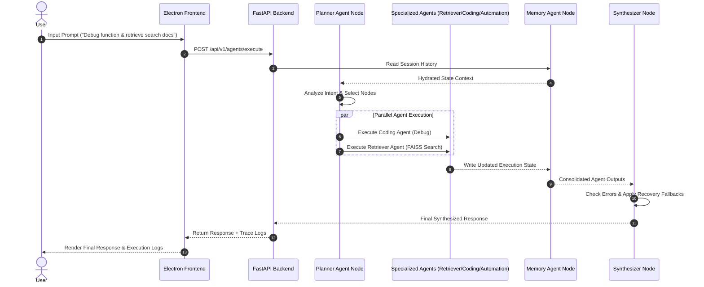

# OSPilot - Offline Production AI Desktop Assistant

> **OSPilot** is a production-quality, 100% local, offline AI Desktop Assistant featuring a modern Electron interface, FastAPI backend, local Ollama LLMs (`qwen3:8b`, `qwen2.5-coder:7b`, `gemma3:latest`), FAISS Vector RAG pipeline, LangGraph Multi-Agent Architecture, AI Coding Assistant, Desktop/Browser Automation, and a Multi-Tier Memory System. Zero cloud dependencies.

---

## 🚀 Key Features Matrix

| Feature | Powered By | Capabilities |
| :--- | :--- | :--- |
| **Interactive Chat** | Local Ollama LLM | Multi-turn memory, token-by-token real-time streaming SSE, model switcher |
| **LangGraph Multi-Agent** | `langgraph.graph.StateGraph` | Planner, Retriever, Automation, Coding, & Memory agents with parallel execution |
| **RAG Document Assistant** | FAISS + nomic-embed-text | Indexes PDF, DOCX, TXT, Markdown; provides Q&A and document summaries |
| **Directory & Semantic Search** | SQLite + FAISS Vector | Scans local folders, indexes text chunks, performs instant semantic retrieval |
| **AI Coding Assistant** | `qwen2.5-coder:7b` | Project tree reading, code explanation, generation, debugging, refactoring, docs |
| **Desktop Automation** | PyAutoGUI + PyWinAuto | Application launch/close, file operations, screenshots, volume, shutdown |
| **Browser Automation** | Playwright Engine | Chrome/Edge web search, form filling, button clicking, file downloads |
| **Multi-Tier Memory** | SQLite + FAISS | Short-term LRU cache, Long-term fact store ("Remember this"), timeframe queries |
| **Live System Monitor** | `psutil` + Dashboard | Monitors CPU %, RAM Memory %, Disk Space, API latency, and Ollama status |
| **Multi-Theme UI** | Vanilla CSS Engine | Dark Glassmorphic (Default), Neon Cyberpunk, Slate Minimal, & Light Mode |

---

## 🏛️ System Architecture

```mermaid
graph TD
    User([User / Electron Desktop UI]) -->|HTTP / SSE Stream / IPC| FastAPI[FastAPI Backend Engine :8000]
    
    subgraph Backend Core
        FastAPI --> Router[API v1 Router]
        Router --> ChatAPI[/chat & /chat/stream]
        Router --> AgentAPI[/agents - LangGraph Orchestrator]
        Router --> CodingAPI[/coding - AI Coding Assistant]
        Router --> MemoryAPI[/memory - Multi-Tier Memory]
        Router --> RAGAPI[/rag - Document Assistant]
        Router --> AutoAPI[/automation - Desktop Control]
        Router --> BrowserAPI[/browser - Playwright Agent]
        Router --> HealthAPI[/health & /health/metrics]
    end

    subgraph Intelligence & Storage Layer
        ChatAPI --> Ollama[Local Ollama Service :11434]
        CodingAPI --> Ollama
        AgentAPI --> LangGraph[LangGraph StateGraph Nodes]
        
        LangGraph --> Planner[Planner Agent]
        LangGraph --> Retriever[Retriever Agent]
        LangGraph --> Automation[Automation Agent]
        LangGraph --> Coding[Coding Agent]
        LangGraph --> Memory[Memory Agent]

        RAGAPI --> FAISS[(FAISS Vector Index)]
        RAGAPI --> SQLite[(SQLite Database - WAL Mode)]
        MemoryAPI --> FAISS
        MemoryAPI --> SQLite
    end

    subgraph OS & Browser Control
        AutoAPI --> PyAutoGUI[PyAutoGUI / PyWinAuto]
        BrowserAPI --> Playwright[Playwright Browser Engine]
    end
```

---

## 🔄 Multi-Agent State Flow



---

## 🛠️ Quick Startup Guide

### Prerequisites
- **Node.js**: v18+
- **Python**: v3.10+
- **Ollama**: Installed locally on `http://localhost:11434` with model `qwen3:8b` or `qwen2.5-coder:7b` (`ollama pull qwen3:8b`)

### Installation & Launch
```powershell
# 1. Clone or navigate to directory
cd "D:\OS Pilot"

# 2. Activate Virtual Environment & Install Dependencies
.\venv\Scripts\Activate.ps1
pip install -r backend/requirements.txt

# 3. Launch Electron Desktop Application
npm start
```

---

## 📡 REST API Reference

### Health & Metrics
- `GET /api/v1/health`: Returns service status and SQLite connectivity.
- `GET /api/v1/health/metrics`: Returns CPU %, RAM %, Disk space %, and latency.

### Chat & Streaming
- `POST /api/v1/chat`: Returns complete LLM response JSON.
- `POST /api/v1/chat/stream`: Returns real-time token SSE text/event-stream.

### LangGraph Multi-Agent
- `POST /api/v1/agents/execute`: Triggers multi-agent StateGraph flow.
- `GET /api/v1/agents/state/{session_id}`: Retrieves session conversation history and state metrics.

### AI Coding Assistant
- `POST /api/v1/coding/read-project`: Scans directory and returns repository tree summary.
- `POST /api/v1/coding/explain`: Returns code explanation & logic breakdown.
- `POST /api/v1/coding/generate`: Returns generated code module.
- `POST /api/v1/coding/debug`: Returns root cause diagnosis & fixed code diff.
- `POST /api/v1/coding/suggest-improvements`: Returns refactored code.
- `POST /api/v1/coding/generate-docs`: Returns docstrings or Markdown specs.
- `POST /api/v1/coding/repo-question`: Answers repository questions grounded in codebase.

### Memory System
- `POST /api/v1/memory/remember`: Stores explicit fact into SQLite & FAISS vector memory.
- `POST /api/v1/memory/query`: Answers natural language memory queries (*"What did I ask yesterday?"*).
- `POST /api/v1/memory/preferences` & `GET /api/v1/memory/preferences`: Reads & writes key-value preferences.
- `GET /api/v1/memory/tasks`: Retrieves automated task execution logs.

---

## 🛡️ Safety & Dangerous Action Confirmations

Every dangerous OS action requires explicit user confirmation via the safety modal wrapper:
- File Deletion (`delete_file`)
- Closing Applications (`close_application`)
- System Shutdown / Restart / Sleep (`shutdown_system`, `restart_system`, `sleep_system`)

---

## 📄 License & Privacy
- **100% Offline & Private**: Zero user data or telemetry is transmitted to cloud APIs.
- Licensed under the MIT License.
